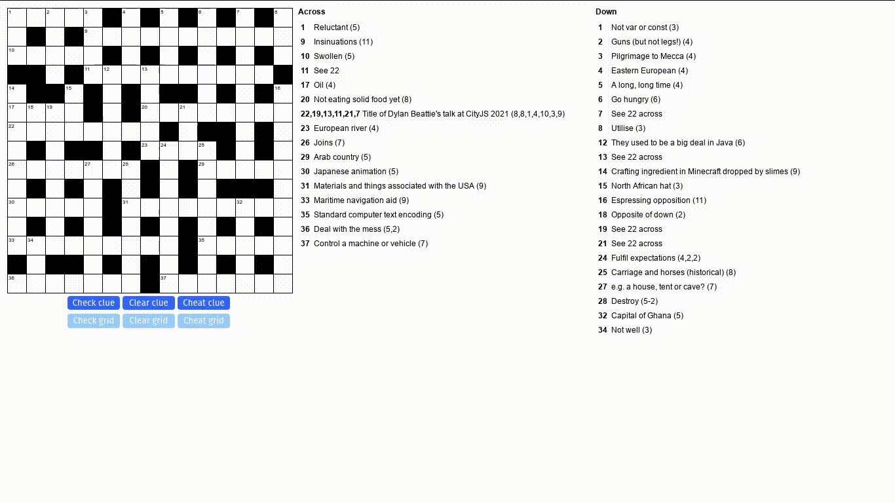

# ipuzzler

A JavaScript client and game grid for ipuz format crossword puzzles.



Find out more on the [iPuzzler website](https://dylanbeattie.github.io/ipuzzler/)

## Usage

iPuzzler is distributed as a single JS file; CSS is inlined into the JS file so there's no external CSS file to use.

To use this for your puzzle follow these instructions:

1. Download the [latest release](https://github.com/dylanbeattie/ipuzzler/releases/latest).
2. Save it somewhere on your website. These instructions assume you’ve saved it into `/js/`.
3. Add `<script type="module" src="js/ipuzzler-0.1.22.js"></script>` to the `<head>` of your page.
4. Publish your crossword puzzle in [iPuz format](http://www.ipuz.org/). Say, as  `my-puzzle.ipuz`.
5. Add `<ipuzzler-puzzle src="my-puzzle.ipuz"></ipuzzler-puzzle>` to your page.

Enjoy!

## Development

Here's how to get a local setup running:

1. Clone the repo: `git clone https://github.com/dylanbeattie/ipuzzler.git`.
2. Switch into it: `cd ipuzzler`.
3. Install dependencies: `npm install`.
4. Start a dev server: `npm run dev`.
5. Open the site in web browser: `http://localhost:3000/`.

iPuzzler uses [vite](https://vitejs.dev), which means it has hot module replacement at dev time; edit any of the project files and your browser will automatically reload to show your changes. 

## Running Tests

iPuzzler uses [vitest](https://vitest.dev). To run all the project tests:

```
$ npm run test

> ipuzzler@0.1.21 test
> vitest

 DEV  v0.17.1 D:/projects/github/dylanbeattie/ipuzzler

 ✓ js/tests/parser.test.js (60)
 ✓ js/tests/puzzle.test.js (80)
 ✓ js/tests/ipuzzler.test.js (109) 863ms
 ✓ js/tests/renderer.test.js (68) 1090ms
 ✓ js/tests/cell.test.js (10)
 ✓ js/tests/position.test.js (2)

Test Files  6 passed (6)
     Tests  329 passed (329)
      Time  3.09s (in thread 2.28s, 135.17%)


 PASS  Waiting for file changes...
       press h to show help, press q to quit
```

## License

MIT license.

## About iPuz

**ipuz** is "the free, open, extensible standard format for all types of what have traditionally been called 'pencil and paper' puzzles."

The ipuz format is documented at [http://www.ipuz.org/](http://www.ipuz.org/)
